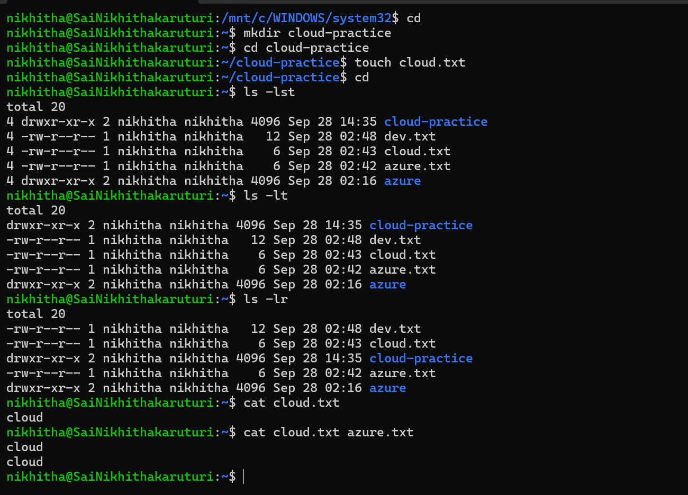

# Week 0 – Day 1: Linux Basics

# Objective
Build a basic understanding of Linux commands as a foundation for my Cloud Engineering journey.
# Topics Learned
* Linux file system
* Files and directories
* Directory navigation
* Creating files and directories
* Copying files
* Moving and renaming files
* Removing files
* Viewing file information
# Commands Practiced

pwd
ls
ls -l
ls -la
cd
cd ..
mkdir
touch
cp
mv
rm
cat
# Hands-on Practice
I practiced:

1. Creating a directory
2. Navigating into the directory
3. Creating a file
4. Creating a subdirectory
5. Listing files and directories
6. Copying a file
7. Navigating between directories
# Practice Screenshot

# What I Learned

I learned how to navigate the Linux file system and perform basic file and directory operations using the terminal.

# Week 0 – Day 1: Completed
