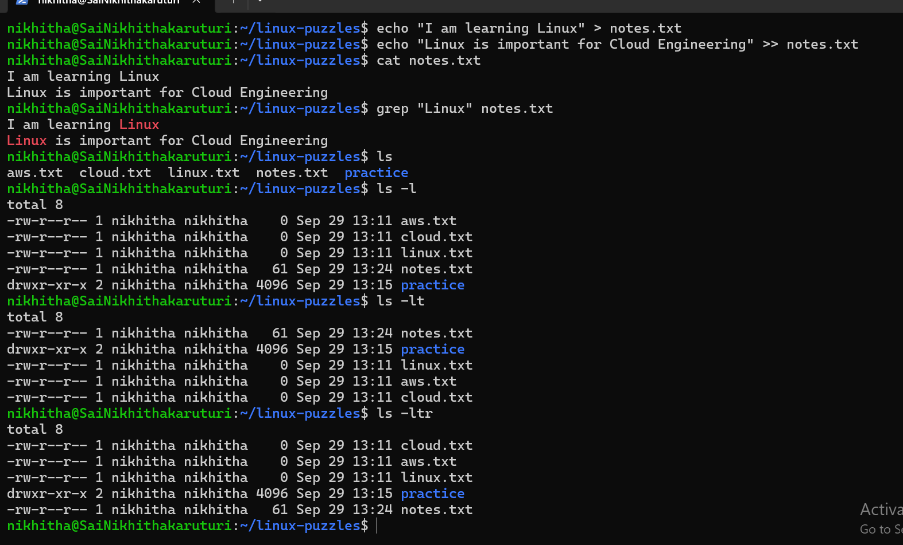

# Week 0 – Day 2: Linux Puzzles
### Objective
Practice Linux commands through simple hands-on exercises and improve my understanding of files, directories, navigation, and text searching.
### Topics Practiced
- File and directory navigation
- Creating files and directories
- Copying files
- Moving and renaming files
- Removing files
- Listing files
- Viewing file contents
- Searching text using grep
### Commands Practiced

- `pwd`
- `ls`
- `ls -l`
- `ls -la`
- `ls -lt`
- `ls -ltr`
- `cd`
- `cd ..`
- `mkdir`
- `touch`
- `cp`
- `mv`
- `rm`
- `cat`
- `grep`
### Linux Puzzles
**Puzzle 1 – Find Files**
Created multiple files and a directory and identified the difference between files and directories.
**Puzzle 2 – Navigation**
Practiced moving between directories using `cd` and `cd ..`.
**Puzzle 3 – Copy and Move**
Copied a file using `cp` and renamed it using `mv`.
**Puzzle 4 – Delete**
Removed a practice file using `rm`.
**Puzzle 5 – Search Text**
Created a text file and used `grep` to find lines containing specific text.
**Puzzle 6 – List Files**
Practiced different `ls` options to view files and directories.

### Practice Screenshot

### What I Learned
I practiced using Linux commands to navigate directories, manage files, view file contents, and search for specific text.

**Week 0 – Day 2: Completed**
