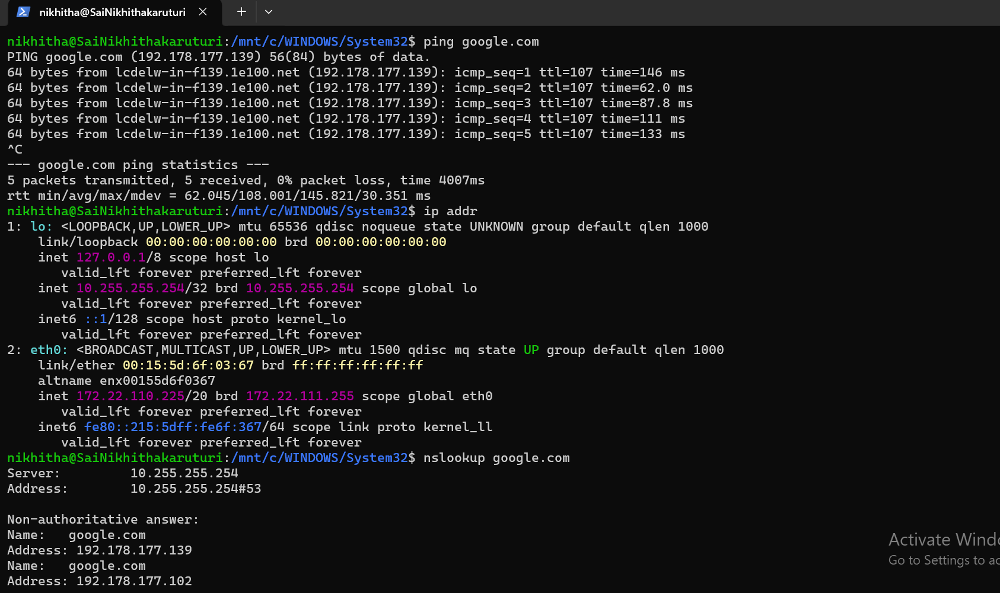

**Week 0 – Day 4: Networking Basics**

**Objective**

Learn the basics of computer networking and understand how devices communicate using IP addresses, DNS, and network protocols.

**Topics Practiced**

- IP addresses
- Private IP addresses
- Loopback address
- DNS
- IPv4 and IPv6
- Network interfaces
- Basic connectivity testing

**Commands Practiced**

`ping google.com`  
`ip addr`  
`nslookup google.com`

**Hands-on Practice**

1. Used `ping google.com` to test network connectivity.
2. Used `ip addr` to view network interfaces and IP addresses.
3. Identified the `lo` loopback interface and `eth0` network interface.
4. Used `nslookup google.com` to understand DNS resolution.
5. Observed IPv4 and IPv6 addresses returned for `google.com`.

**What I Learned**

I learned how IP addresses identify devices on a network and how DNS converts domain names into IP addresses. I also learned how to view network interfaces and test basic network connectivity.

**Practice Screenshot**

**Status**

**Week 0 – Day 4: Completed**
