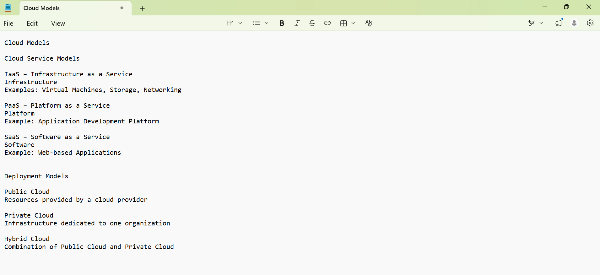

**Week 0 – Day 5: Cloud Models**

**Objective**

Understand the basic cloud service models and deployment models used in cloud computing.

**Topics Practiced**

- Cloud computing basics
- IaaS – Infrastructure as a Service
- PaaS – Platform as a Service
- SaaS – Software as a Service
- Public Cloud
- Private Cloud
- Hybrid Cloud

**Cloud Service Models**

**IaaS – Infrastructure as a Service**

Provides virtual machines, storage, networking, and other infrastructure resources.

**PaaS – Platform as a Service**

Provides a platform and environment for developing and deploying applications without managing the underlying infrastructure.

**SaaS – Software as a Service**

Provides software applications over the internet without requiring users to manage the underlying infrastructure.

**Cloud Deployment Models**

**Public Cloud**

Cloud resources are provided by a cloud provider and accessed over the internet.

**Private Cloud**

Cloud infrastructure is dedicated to a single organization.

**Hybrid Cloud**

Combines private cloud infrastructure with public cloud resources.

**What I Learned**

I learned the difference between IaaS, PaaS, and SaaS and understood the basic differences between public, private, and hybrid cloud models.
**Practice Screenshot**

**Status**

**Week 0 – Day 5: Completed**
