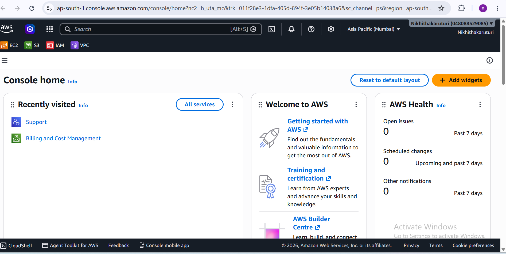

**Week 1 – Day 6: Cloud Foundations – AWS**

**Objective**

Get familiar with AWS and understand the basic AWS cloud services and console.

**Topics Practiced**

- AWS Cloud Platform
- AWS Management Console
- AWS Regions
- Availability Zones
- EC2
- S3
- IAM
- VPC
- CloudWatch
- Basic AWS cost awareness

**AWS Services Learned**

**EC2 – Elastic Compute Cloud**

Provides virtual servers for running applications and workloads.

**S3 – Simple Storage Service**

Provides object storage for storing files and data.

**IAM – Identity and Access Management**

Manages users, roles, permissions, and access to AWS resources.

**VPC – Virtual Private Cloud**

Provides networking resources for AWS infrastructure.

**CloudWatch**

Used for monitoring AWS resources, applications, metrics, and logs.

**Hands-on Practice**

- Signed in to the AWS Management Console
- Explored the AWS Console home page
- Checked the AWS Region
- Explored AWS services including EC2, S3, IAM, and VPC
- Reviewed the AWS Console environment

**What I Learned**

I learned the basic structure of the AWS cloud platform and became familiar with the AWS Management Console and commonly used AWS services.

**Practice Screenshot**

**Status**

**Week 1 – Day 6: Completed**
