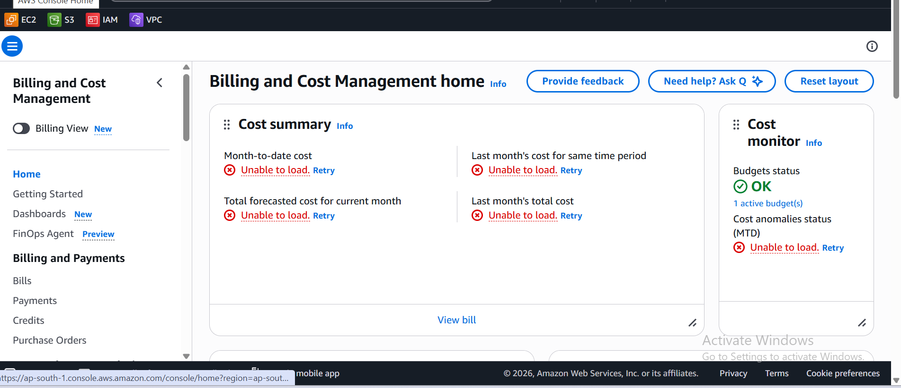

**Week 1 – Day 7: AWS Cost Awareness**

**Objective**

Understand the basics of AWS cost management and learn where to review billing and usage information.

**Topics Practiced**

- AWS Billing and Cost Management
- AWS Cost Summary
- AWS Cost Monitor
- AWS Budgets
- AWS Bills
- AWS Payments
- AWS Credits
- Basic AWS cost awareness

**Hands-on Practice**

- Opened AWS Billing and Cost Management
- Explored the Billing and Cost Management home page
- Reviewed the Cost Summary section
- Reviewed the Cost Monitor section
- Checked the Budgets status
- Explored the Bills, Payments, and Credits sections
- Learned the importance of monitoring cloud resources and costs

**What I Learned**

I learned where AWS billing and cost information can be reviewed. I also learned that monitoring cloud resources and budgets is important to avoid unnecessary cloud expenses.

**Practice Screenshot**

**Week 1 Review**

During Week 1, I learned the basics of AWS, explored the AWS Management Console, became familiar with core AWS services, and practiced basic AWS cost awareness.

**Status**

**Week 1 – Day 7: Completed**
