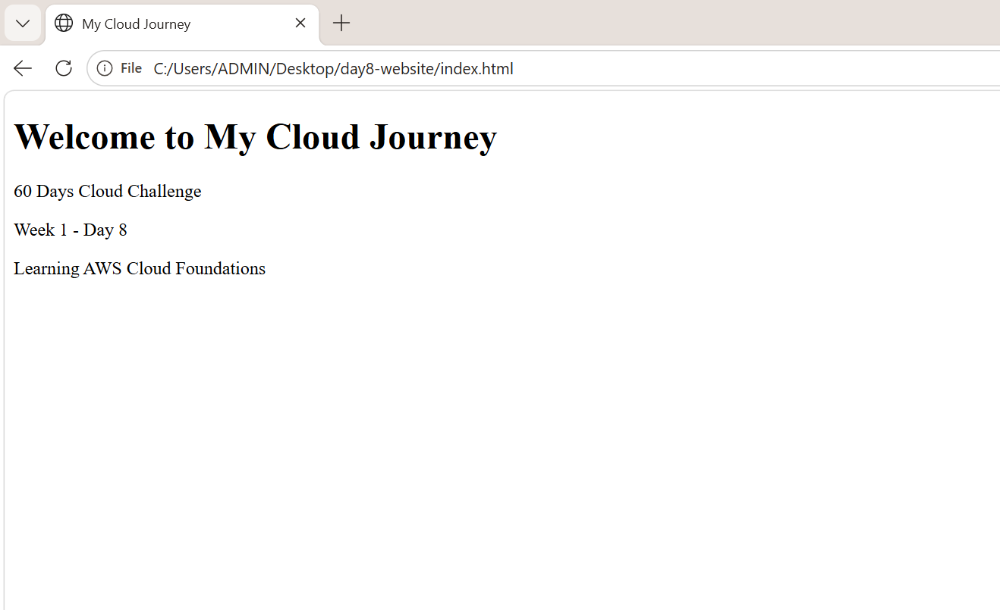

**Week 1 – Day 8: Deploy a Static Website on AWS S3**

**Objective**

Learn how Amazon S3 can be used to host a static website.

**Topics Practiced**

- Amazon S3
- S3 Buckets
- Object Storage
- Static Website Hosting
- HTML Website Deployment
- S3 Bucket Permissions

**Hands-on Practice**

- Created an Amazon S3 bucket
- Created a simple HTML webpage
- Uploaded the `index.html` file to S3
- Enabled static website hosting
- Configured `index.html` as the index document
- Configured public read access for the website
- Accessed the website using the S3 website endpoint

**What I Learned**

I learned how Amazon S3 can be used to store website files and host a static website. I also learned how to configure static website hosting and make the website accessible through an S3 website endpoint.

**Practice Screenshot**

**Status**

**Week 1 – Day 8: Completed**
