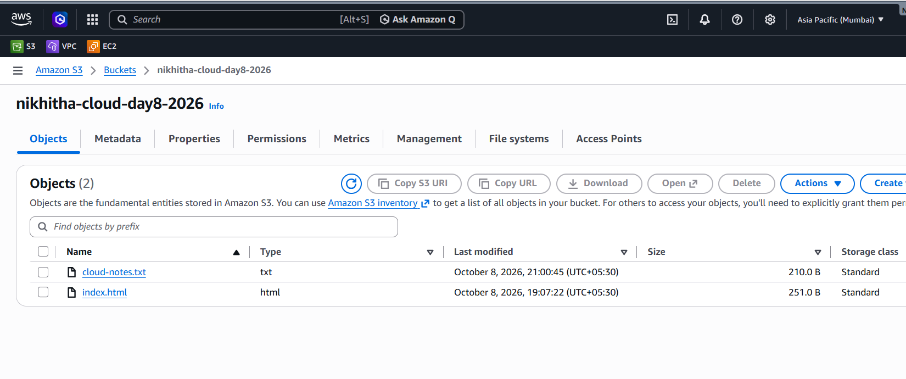

**Week 1 – Day 9: AWS S3 Storage Practice**

**Objective**

Understand how Amazon S3 stores objects and practice basic S3 object operations.

**Topics Practiced**

- Amazon S3
- S3 Buckets
- S3 Objects
- Uploading objects
- Viewing objects
- Downloading objects
- Deleting objects

**Hands-on Practice**

- Used the existing S3 bucket `nikhitha-cloud-day8-2026`
- Created a `cloud-notes.txt` file
- Uploaded the file to the S3 bucket
- Viewed the uploaded object
- Downloaded the object from S3
- Deleted the temporary object
- Verified that the `index.html` website file remained in the bucket

**What I Learned**

I learned that Amazon S3 stores data as objects inside buckets. I also practiced the basic workflow of uploading, viewing, downloading, and deleting objects in an S3 bucket.

**Practice Screenshot**

**Status**

**Week 1 – Day 9: Completed**
